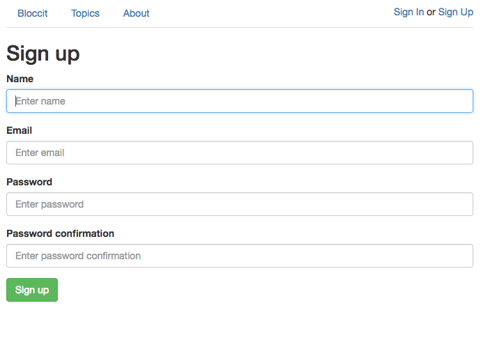
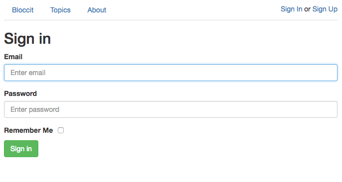
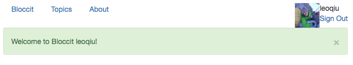
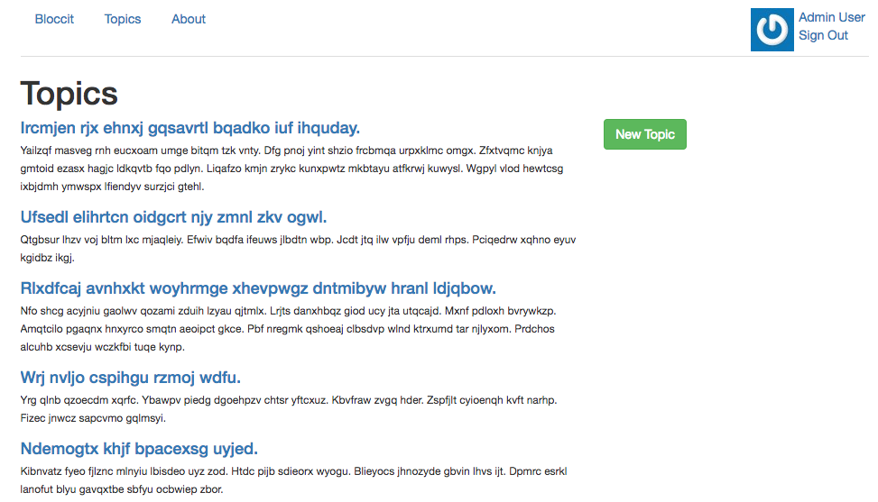
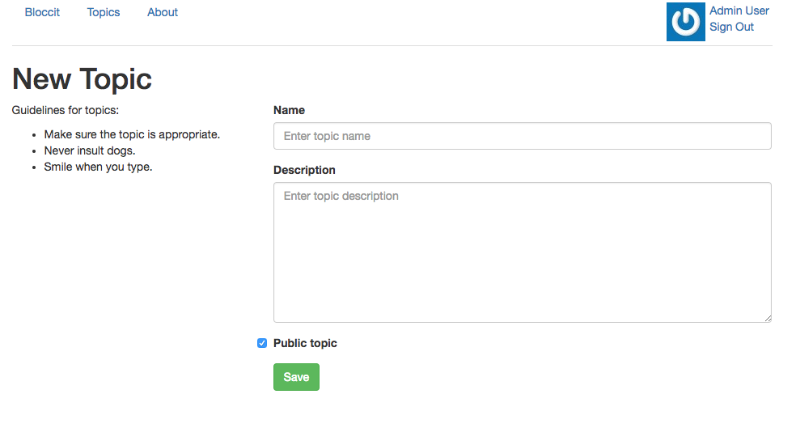
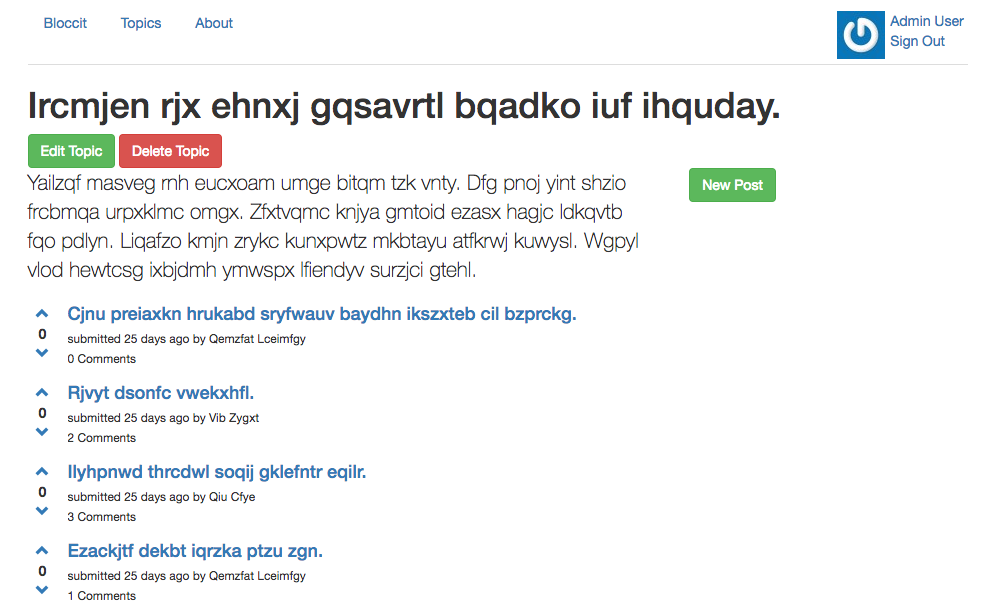

#Bloccit

##Overview
Just like Reddit, Bloccit is an app where user can post, vote on, share and save links and comments. 

##User Sign Up
Bloccit allows public to sign up for the application.

##User Sign in
Signing in to an application reuires user information to persist while a user is signed in to Bloccit. User information is authenticated and retained until they sign out. Session object is used to persist user's information. 

##Gravatar
Bloccit uses Gravatar to display user's avatar

##User can view a list of Topic and Posts
Since Bloccit users will create a large number of posts, and will need a way to organize or categorize them. Bloccit uses `has_many` and `belongs_to` associations between Topic, Posts, and Users.

##User can create Topics, Posts and Comments
Bloccit uses nested routing for Topics, Posts and Comments.Comments are built as a separate resource, and in doing so, it uses shallow nesting to prevent routes from becoming long and cumbersome.

##User can vote on, and save links and comments
Bloccit can have thousands of posts, and users can distinguish the good from the bad by voting. The `Vote` model will be associated with the `User` and `Post` models. 

